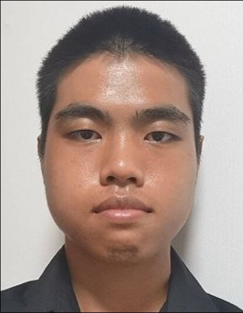
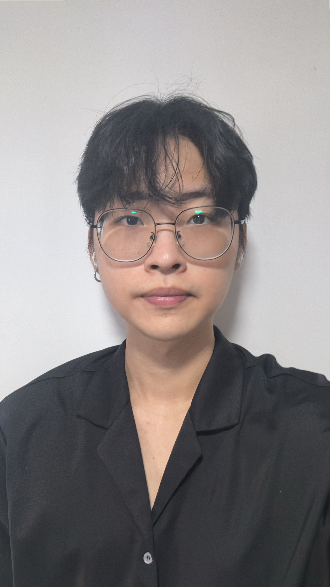
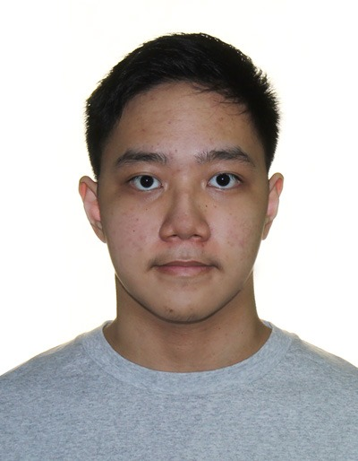
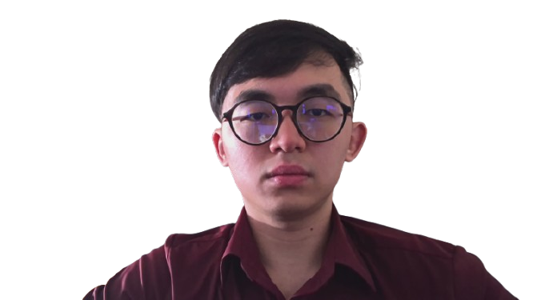

We are a team based in the [School of Computing, National University of Singapore](https://www.comp.nus.edu.sg).

You can reach us at the email `seer[at]comp.nus.edu.sg`

## Project team

### Sean Sim

[[github](https://github.com/botosek)]
[[portfolio](team/botosek.md)]

* Role: Developer
* Responsibilities: Documentation, In charge of State component

### Yeo Yi Wen

[[github](http://github.com/johndoe)]
[[portfolio](team/xenyeo)]

* Role: Developer
* Responsibilities: Documentation, Scheduling and tracking

### Tang Dan Cheng

[[github](http://github.com/tadacheng)]
[[portfolio](team/tadacheng.md)]

* Role: Developer
* Responsibilities: Testing, Model

### Deborah Lu

[[github](https://github.com/deberinoo)]
[[portfolio](team/johndoe.md)]

* Role: Developer
* Responsibilities: Code Quality

### Philip Hew

[[github](http://github.com/dnardnar)]
[[portfolio](team/dnardnar.md)]

* Role: Developer
* Responsibilities: Documentation, Deliverables and deadlines, Integration
