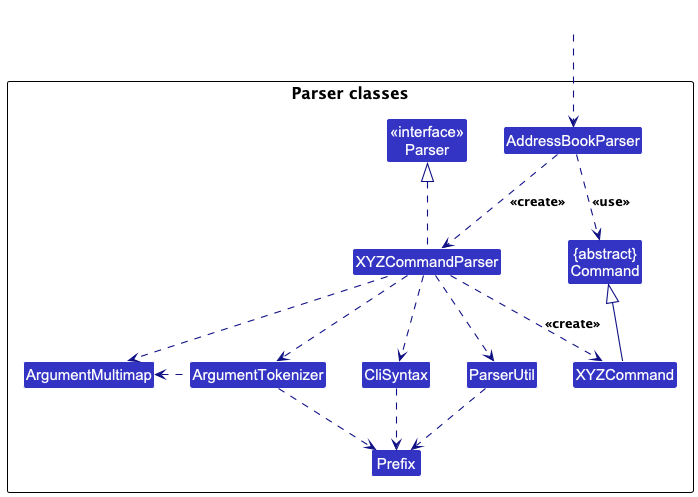
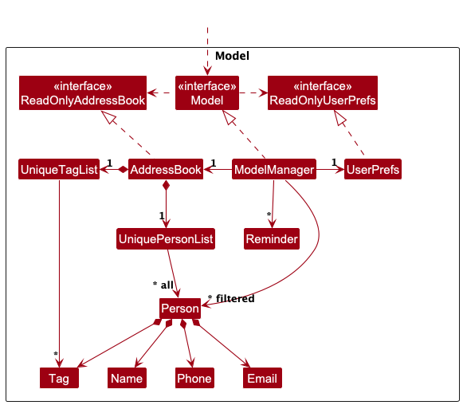
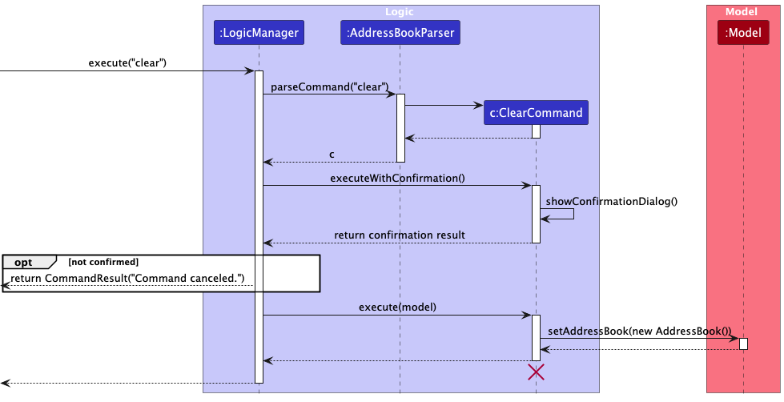
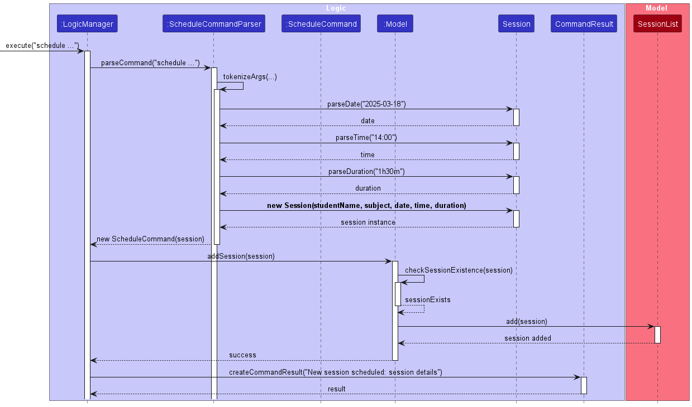
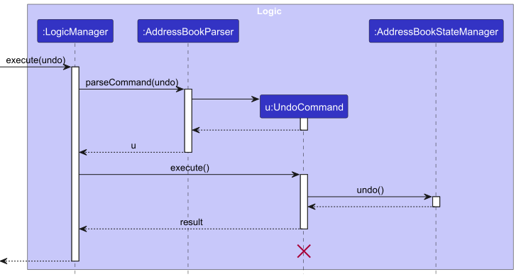
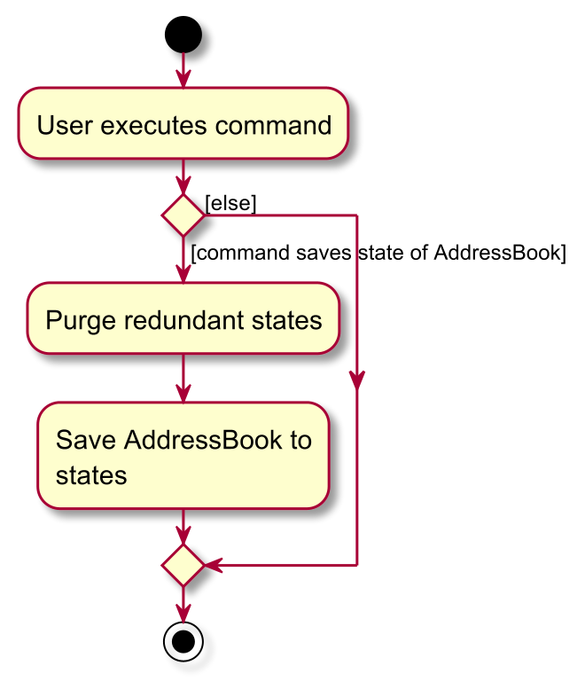

* Table of Contents
{:toc}

--------------------------------------------------------------------------------------------------------------------

## **Acknowledgements**

* This project is based on the AddressBook-Level3 project created by the [SE-EDU initiative](https://se-education.org).

--------------------------------------------------------------------------------------------------------------------

## **Setting up, getting started**

Refer to the guide [_Setting up and getting started_](SettingUp.md).

--------------------------------------------------------------------------------------------------------------------

## **Design**

:bulb: **Tip:** The `.puml` files used to create diagrams in this document `docs/diagrams` folder. Refer to the [_PlantUML Tutorial_ at se-edu/guides](https://se-education.org/guides/tutorials/plantUml.html) to learn how to create and edit diagrams.

### Architecture

The ***Architecture Diagram*** given above explains the high-level design of the App.

Given below is a quick overview of main components and how they interact with each other.

**Main components of the architecture**

**`Main`** (consisting of classes [`Main`](https://github.com/se-edu/addressbook-level3/tree/master/src/main/java/seedu/address/Main.java) and [`MainApp`](https://github.com/se-edu/addressbook-level3/tree/master/src/main/java/seedu/address/MainApp.java)) is in charge of the app launch and shut down.
* At app launch, it initializes the other components in the correct sequence, and connects them up with each other.
* At shut down, it shuts down the other components and invokes cleanup methods where necessary.

The bulk of the app's work is done by the following four components:

* [**`UI`**](#ui-component): The UI of the App.
* [**`Logic`**](#logic-component): The command executor.
* [**`Model`**](#model-component): Holds the data of the App in memory.
* [**`Storage`**](#storage-component): Reads data from, and writes data to, the hard disk.

[**`Commons`**](#common-classes) represents a collection of classes used by multiple other components.

**How the architecture components interact with each other**

The *Sequence Diagram* below shows how the components interact with each other for the scenario where the user issues the command `delete 1`.

Each of the four main components (also shown in the diagram above),

* defines its *API* in an `interface` with the same name as the Component.
* implements its functionality using a concrete `{Component Name}Manager` class which follows the corresponding API `interface` mentioned in the previous point.

For example, the `Logic` component defines its API in the `Logic.java` interface and implements its functionality using the `LogicManager.java` class which follows the `Logic` interface. Other components interact with a given component through its interface rather than the concrete class (reason: to prevent outside component's being coupled to the implementation of a component), as illustrated in the (partial) class diagram below.

The sections below give more details of each component.

### UI component

The **API** of this component is specified in [`Ui.java`](https://github.com/se-edu/addressbook-level3/tree/master/src/main/java/seedu/address/ui/Ui.java)

The UI consists of a `MainWindow` that is made up of parts e.g.`CommandBox`, `ResultDisplay`, `PersonListPanel`, `StatusBarFooter` etc. All these, including the `MainWindow`, inherit from the abstract `UiPart` class which captures the commonalities between classes that represent parts of the visible GUI.
Inside the 'MainWindow', there are three panels 'PersonListPanel', ReminderPanel' and 'SessionPanel'.

The `UI` component uses the JavaFx UI framework. The layout of these UI parts are defined in matching `.fxml` files that are in the `src/main/resources/view` folder. For example, the layout of the [`MainWindow`](https://github.com/se-edu/addressbook-level3/tree/master/src/main/java/seedu/address/ui/MainWindow.java) is specified in [`MainWindow.fxml`](https://github.com/se-edu/addressbook-level3/tree/master/src/main/resources/view/MainWindow.fxml)

The `UI` component,

* executes user commands using the `Logic` component.
* listens for changes to `Model` data so that the UI can be updated with the modified data.
* keeps a reference to the `Logic` component, because the `UI` relies on the `Logic` to execute commands.
* depends on some classes in the `Model` component, as it displays `Person` object residing in the `Model`.
* it displays 'Reminder' object residing in the 'Model' in a separate tab.
### Logic component

**API** : [`Logic.java`](https://github.com/se-edu/addressbook-level3/tree/master/src/main/java/seedu/address/logic/Logic.java)

Here's a (partial) class diagram of the `Logic` component:

The sequence diagram below illustrates the interactions within the `Logic` component, taking `execute("delete 1")` API call as an example.

:information_source: **Note:** The lifeline for `DeleteCommandParser` should end at the destroy marker (X) but due to a limitation of PlantUML, the lifeline continues till the end of diagram.

How the `Logic` component works:

1. When `Logic` is called upon to execute a command, it is passed to an `AddressBookParser` object which in turn creates a parser that matches the command (e.g., `DeleteCommandParser`) and uses it to parse the command.
1. This results in a `Command` object (more precisely, an object of one of its subclasses e.g., `DeleteCommand`) which is executed by the `LogicManager`.
1. The command can communicate with the `Model` when it is executed (e.g. to delete a person). 
   Note that although this is shown as a single step in the diagram above (for simplicity), in the code it can take several interactions (between the command object and the `Model`) to achieve.
1. The result of the command execution is encapsulated as a `CommandResult` object which is returned back from `Logic`.

Here are the other classes in `Logic` (omitted from the class diagram above) that are used for parsing a user command:

How the parsing works:
* When called upon to parse a user command, the `AddressBookParser` class creates an `XYZCommandParser` (`XYZ` is a placeholder for the specific command name e.g., `AddCommandParser`) which uses the other classes shown above to parse the user command and create a `XYZCommand` object (e.g., `AddCommand`) which the `AddressBookParser` returns back as a `Command` object.
* All `XYZCommandParser` classes (e.g., `AddCommandParser`, `DeleteCommandParser`, ...) inherit from the `Parser` interface so that they can be treated similarly where possible e.g, during testing.

### Model component
**API** : [`Model.java`](https://github.com/AY2425S2-CS2103-F09-2/tp/blob/master/src/main/java/seedu/address/model/Model.java)

The `Model` component,

* stores the address book data i.e., all `Person` objects (which are contained in a `UniquePersonList` object), and all `Tag` objects (which are contained in a `UniqueTagList` object).
* stores the currently 'selected' `Person` and `Tag` objects (e.g., results of a search query) as a separate _filtered_ list which is exposed to outsiders as an unmodifiable `ObservableList<Person>` and `ObservableList<Tag>` that can be 'observed' e.g. the UI can be bound to this list so that the UI automatically updates when the data in the list change.
* stores a `UserPref` object that represents the user’s preferences. This is exposed to the outside as a `ReadOnlyUserPref` objects.
* does not depend on any of the other three components (as the `Model` represents data entities of the domain, they should make sense on their own without depending on other components)
* has a `Tag` list in the `AddressBook` which `Person` references.
* `AddressBook` only requires one `Tag` object per unique tag, instead of each `Person` needing their own `Tag` objects.
* stores the list of reminders i.e., ObservableList<Reminder> object

### Storage component

**API** : [`Storage.java`](https://github.com/se-edu/addressbook-level3/tree/master/src/main/java/seedu/address/storage/Storage.java)

The `Storage` component,
* can save both address book data and user preference data in JSON format, and read them back into corresponding objects.
* inherits from both `AddressBookStorage` and `UserPrefStorage`, which means it can be treated as either one (if only the functionality of only one is needed).
* depends on some classes in the `Model` component (because the `Storage` component's job is to save/retrieve objects that belong to the `Model`)

### Common classes

Classes used by multiple components are in the `seedu.address.commons` package.

--------------------------------------------------------------------------------------------------------------------

## **Implementation**

This section describes some noteworthy details on how certain features are implemented.

### Command with confirmation
The `CommandWithConfirmation` interface is designed for commands that require user confirmation before execution.
This ensures that irreversible or sensitive actions prompt the user for explicit approval before proceeding.

* `CommandWithConfirmation` is an interface implemented by commands that require confirmation.
* `CommandWithConfirmation#showConfirmationDialog()` is a default method that prompts the user for confirmation

`LogicManager` is responsible for identifying and executing confirmation-based commands.
`UI` handles displaying the confirmation dialog.

Given below is an example usage scenario and how the confirmation mechanism behaves at each step.

Step 1. The user inputs a command that implements `CommandWithConfirmation` (e.g., clear).

Step 2. `LogicManager` calls `AddressBookParser` to parse the command and instantiate it.

Step 3. `LogicManager` checks if the command requires confirmation (instanceof `CommandWithConfirmation`).

Step 4. The `executeWithConfirmation()` method is invoked, triggering `showConfirmationDialog()`.

Step 5. If the user confirms, `execute()` is called to perform the command.
If the user cancels, the command is aborted, and a message is displayed.

The following sequence diagram illustrates the execution flow of a command requiring confirmation:

This confirmation dialog acts as an extra safeguard,
ensuring users are aware of the consequences before executing commands,
while undo provides an additional safety net.

### Scheduling a Session
The `Schedule Command` follows a structured sequence to ensure that a session is scheduled properly. Below is an explanation of how the components interact when the user issues the schedule command.

Step 1. LogicManager receives the schedule command and delegates it to the Parser.

Step 2. The Parser tokenizes the command and extracts details such as date, time, and duration, then requests Session to parse them.

Step 3. The Parser creates a Session object with the parsed details and sends it back to LogicManager.

Step 4. LogicManager passes the session to the Model, which checks if the session already exists.

Step 5. If valid, the Model adds the session to the SessionList.

Step 6. LogicManager creates a CommandResult, confirming that the session was successfully scheduled, and returns it to the user.

The following Schedule Sequence Diagram visually represents these interactions.

### Undo/redo feature

#### Proposed Implementation

The undo/redo mechanism is facilitated by `AddressBookStateManager`. It includes `AddressBook` with an undo/redo history, stored internally as a `states` and `currentState`. Additionally, it implements the following operations:

* `VersionedAddressBook#commit()` — Saves the current address book state in its history.
* `VersionedAddressBook#undo()` — Restores the previous address book state from its history.
* `VersionedAddressBook#redo()` — Restores a previously undone address book state from its history.

These operations are exposed in the `Model` interface as `AddressBookStateManager#addState()`, `AddressBookStateManager#undo()` and `AddressBookStateManager#redo()` respectively.

Given below is an example usage scenario and how the undo/redo mechanism behaves at each step.

Step 1. The user launches the application for the first time. The `VersionedAddressBook` will be initialized with the initial address book state, and the `currentState` pointing to that single address book state.

Step 2. The user executes `delete 5` command to delete the 5th person in the address book. The `delete` command calls `Model#commitAddressBook()`, causing the modified state of the address book after the `delete 5` command executes to be saved in the `AddressBookStateManager`, and the `currentState` is shifted to the newly inserted address book state.

Step 3. The user executes `add n/David …​` to add a new person. The `add` command also calls `AddressBoookStateManager#addState()`, causing another modified address book state to be saved into the `States`.

:information_source: **Note:** If a command fails its execution, it will not call `AddressBookStateManager#addState()`, so the address book state will not be saved into the `State`.

Step 4. The user now decides that adding the person was a mistake, and decides to undo that action by executing the `undo` command. The `undo` command will call `AddressBookStateManager#undo()`, which will shift the `currentState` once to the left, pointing it to the previous address book state, and restores the address book to that state.

:information_source: **Note:** If the `currentState` is at index 0, pointing to the initial AddressBook state, then there are no previous AddressBook states to restore. The `AddressBookStateManager#canUndoAddressBook()` will throw an exception that the `undo` command will catch. It will then return an error to the user rather
than attempting to perform the undo.

The following sequence diagram shows how an undo operation goes through the `Logic` component:

:information_source: **Note:** The lifeline for `UndoCommand` should end at the destroy marker (X) but due to a limitation of PlantUML, the lifeline reaches the end of diagram.

The `redo` command does the opposite — it calls `AddressBookStateManager#redo()`, which shifts the `currentState` once to the right, pointing to the previously undone state, and restores the address book to that state.

:information_source: **Note:** If the `currentState` is at index `states.size() - 1`, pointing to the latest address book state, then there are no undone AddressBook states to restore. The `AddressBookStateManager#redo()` throws an exception that the `redo` command will catch. If so, it will return an error to the user rather than attempting to perform the redo.

Step 5. The user then decides to execute the command `list`. Commands that do not modify the address book, such as `list`, will usually not call `AddressBookStateManager#addState()`, `AddressBookStateManager#undo()` or `AddressBookStateManager#redo()`. Thus, the `states` remains unchanged.

Step 6. The user executes `clear`, which calls `AddressBookStateList#addState()`. Since the `currentState` is not pointing at the end of the `states`, all address book states after the `currentState` will be purged. Reason: It no longer makes sense to redo the `add n/David …​` command. This is the behavior that most modern desktop applications follow.

The following activity diagram summarizes what happens when a user executes a new command:

#### Design considerations:

**Aspect: How undo & redo executes:**

* **Alternative 1 (current choice):** Saves the entire address book.
  * Pros: Easy to implement.
  * Cons: May have performance issues in terms of memory usage.

* **Alternative 2:** Individual command knows how to undo/redo by
  itself.
  * Pros: Will use less memory (e.g. for `delete`, just save the person being deleted).
  * Cons: We must ensure that the implementation of each individual command are correct.

_{more aspects and alternatives to be added}_

### \[Proposed\] Data archiving

_{Explain here how the data archiving feature will be implemented}_

--------------------------------------------------------------------------------------------------------------------

## **Documentation, logging, testing, configuration, dev-ops**

* [Documentation guide](Documentation.md)
* [Testing guide](Testing.md)
* [Logging guide](Logging.md)
* [Configuration guide](Configuration.md)
* [DevOps guide](DevOps.md)

--------------------------------------------------------------------------------------------------------------------

## **Appendix: Requirements**

**Team**: F09-02

**Product Name**: EduEase

### Product scope

**Target user profile**: Private home tutors providing one-on-one remote sessions for primary students on math.
* is a tutor managing student contacts
* prefer desktop apps over other types
* can type fast
* prefers typing to mouse interactions
* is reasonably comfortable using CLI apps

**Value proposition**: EduEase simplifies the management of student contact details, helping private tutors stay organized. It allows them to focus on delivering high-quality teaching while reducing administrative burdens, such as their students' progress and contacts, thereby enhancing their productivity.

### User stories

Priorities: High (must have) - `* * *`, Medium (nice to have) - `* *`, Low (unlikely to have) - `*`

| Priority | As a …​ | I want to …​                                                                            | So that I can…​                                                                        |
|----------|---------|-----------------------------------------------------------------------------------------|----------------------------------------------------------------------------------------|
| `* * *`  | tutor   | add new student contacts with details (Eg. name, phone, email, parent/guardian contact, etc.) | keep track of my students easily                                                       |
| `* * *`  | tutor   | delete student contacts                                                                 | remove outdated or incorrect contacts                                                  |
| `* * *`  | tutor   | view a simple list of all my students                                                   | quickly find their details                                                             |
| `* * *`  | tutor   | set reminders for upcoming exams or important dates for each student                    | prepare appropriate review materials in advance                                        |
| `* * *`  | tutor   | create custom tags for students                                                         | filter and group them more efficiently                                                 |
| `* *`    | tutor   | edit existing student contacts                                                          | keep student information up to date                                                    |
| `* *`    | tutor   | add notes about each student's progress                                                 | personalize my lessons                                                                 |
| `* *`    | tutor   | clear all student contacts                                                              | remove all contacts quickly                                                            |
| `* *`    | tutor   | categorize my contacts (Eg. Current students, past students, etc.)                      | manage them efficiently                                                                |
| `* *`    | tutor   | manually schedule tutoring sessions                                                     | keep track of upcoming classes                                                         |
| `* *`    | tutor   | view all scheduled sessions in a simple calendar                                        | stay organized                                                                         |
| `* *`    | tutor   | reschedule or cancel a session manually                                                 | update my availability                                                                 |
| `* *`    | tutor   | filter my schedule by student                                                           | see sessions for a specific student                                                    |
| `* *`    | tutor   | set recurring sessions for regular students                                             | avoid manually scheduling them every week                                              |
| `* *`    | tutor   | undo the last action                                                                    | recover from mistakes                                                                  |
| `* *`    | tutor   | undoes undo commands                                                                    | revert undo commands                                                                   |
| `* *`    | tutor   | switch between different tabs                                                           | view a different tab                                                                   |
| `*`      | tutor   | manually save my student data as a local file                                           | back up my records                                                                     |
| `*`      | tutor   | write notes after a session                                                             | review what was covered                                                                |
| `*`      | tutor   | mark a session as completed                                                             | track my past lessons                                                                  |
| `*`      | tutor   | keep a history of past sessions                                                         | refer to them later                                                                    |
| `*`      | tutor   | receive simple local notifications before a session starts                              | be prepared for it                                                                     |
| `*`      | tutor   | track the payment status of each session                                                | easily manage my income and follow up on any outstanding payments                      |
| `*`      | tutor   | generate a simple progress report for each student                                      | share their improvement or areas that need further attention with parents or guardians |
| `*`      | tutor   | add and view teaching resources (Eg. Worksheets, Practice questions, etc.)              | quickly access relevant materials during sessions                                      |
| `*`      | tutor   | set goals for each student and track their progress towards these goals                 | provide targeted support and motivation                                                |
| `*`      | tutor   | view a summary of my weekly or monthly teaching hours                                   | manage my workload effectively                                                         |
| `*`      | tutor   | upload and store student assignments or completed work                                  | review them later and track their progress over time                                   |
| `*`      | tutor   | quickly message a student or their parent directly from the app                         | communicate easily about scheduling changes or important updates                       |
| `*`      | tutor   | track the duration of each session                                                      | accurately log my teaching hours                                                       |
| `*`      | tutor   | archive inactive students instead of deleting them                                      | refer to their records later if needed                                                 |
| `*`      | tutor   | import student contacts from a CSV of Excel file                                        | quickly set up my student database                                                     |

*{More to be added}*

### Use Cases

(For all use cases below, the **System** is the `EduEase` and the **Actor** is the `user`, unless specified otherwise)

---

**Use case: Add a new student contact**

**MSS**

1. Tutor enters the command to add a new student with details (name, phone number, email, parent contact).
2. EduEase checks if inputs given are valid.
3. If all fields are valid, EduEase saves the student contact.
4. EduEase confirms the addition with a success message.

   Use case ends.

**Extensions**

* 2a. Invalid input format.
    * 2a1. EduEase displays an appropriate error message and prompts for correction.  
      Use case resumes at step 1.

* 2b. Duplicate student detected
    * 2b1. EduEase notifies the tutor that the student already exists.
    * 2b2. Tutor decides to update existing information or cancel the operation.  
      Use case resumes at step 2.

---

**Use case: Delete a student contact**

**MSS**

1. Tutor enters the command to delete a student by rank.
2. EduEase checks if the rank is valid.
3. If valid, EduEase deletes the student contact.
4. EduEase confirms the deletion with a success message.

   Use case ends.

**Extensions**

* 2a. The rank does not exist.
    * 2a1. EduEase displays an error message.  
      Use case resumes at step 1.

* 2b. A non-integer value is entered.
    * 2b1. EduEase prompts for a correct format.  
      Use case resumes at step 1.

---

**Use case: List student contacts**

**MSS**

1. Tutor enters the command to list all student contacts.
2. EduEase retrieves and displays a list of students, including their details (name, phone number, email, parent contact, tags).

   Use case ends.

**Extensions**

* 2a. If no students exist.
    * 2a1. EduEase displays a message indicating that the list is empty.  
      Use case ends.

* 2b. If an invalid command is entered.
    * 2b1. EduEase displays an error message.  
      Use case resumes at step 1.

---

**Use case: Set reminders for upcoming exams or important dates**

**MSS**

1. Tutor enters the command to set a reminder.
2. EduEase validates the input parameters.
3. If all parameters are valid, EduEase saves the reminder.
4. EduEase confirms the addition with a success message.

   Use case ends.

**Extensions**

* 2a. If any parameter is missing or invalid or there is additional preamble.
    * 2a1. EduEase displays an error message based on the specific issue.  
      Use case resumes at step 1.

* 2b. If the date is in the past.
    * 2b1. EduEase displays an error message based on the date today.  
      Use case resumes at step 1.

* 2c. If the student does not exist.
    * 2c1. EduEase displays an error message.  
      Use case resumes at step 1.

* 2d. If a duplicate reminder exists.
    * 2d1. EduEase notifies the tutor that a similar reminder already exists.
    * 2d2. Tutor decides to update existing information or cancel the operation.  
      Use case resumes at step 1.

---

**Use case: Add tags to student contacts**

**MSS**

1. Tutor enters the command to add a student with tags.
2. EduEase validates the tag parameters.
3. If all parameters are valid, EduEase adds the student with the specified tags.
4. EduEase confirms the addition with a success message.

   Use case ends.

**Extensions**

* 2a. If a tag contains invalid characters or exceeds 25 characters.
    * 2a1. EduEase displays an error message based on the specific issue.  
      Use case resumes at step 1.

* 2b. If more than 5 tags are provided.
    * 2b1. EduEase displays an error message.  
      Use case resumes at step 1.

* 2c. If a duplicate tag is entered for the same student.
    * 2c1. EduEase does not add the duplicate tag.  
      Use case resumes at step 1.

* 2d. If a tag is empty.
    * 2d1. EduEase displays an error message.  
      Use case resumes at step 1.

---

**Use case: Set notes for each student**

**MSS**

1. Tutor enters the command to set a note.
2. EduEase validates the input parameters.
3. If all parameters are valid, EduEase saves the note.
4. EduEase confirms the addition with a success message and displays the note.

   Use case ends.

**Extensions**

* 2a. If index parameter is missing or invalid.
    * 2a1. EduEase displays an error message based on the specific issue.  
      Use case resumes at step 1.

* 2b. If the arguments are invalid.
    * 2b1. EduEase displays the original note.  
      Use case resumes at step 3.

* 2c. If multiple arguments exist.
    * 2c1. EduEase will prioritise appending to the note.  
      Use case resumes at step 3.

---

**Use case: Schedule a tutoring session**

**MSS**

1. Tutor enters the command to schedule a session.
2. EduEase validates the input parameters (student name, subject, date, time, and duration).
3. If all parameters are valid, EduEase schedules the session.
4. EduEase confirms the session has been scheduled with a success message, displaying the session details.

   Use case ends.

**Extensions**

* 2a. If a parameter is missing or invalid.
    * 2a1. EduEase displays an error message based on the specific issue.  
      Use case resumes at step 1.

* 2b. If any argument is invalid.
    * 2b1. EduEase displays the original session details.  
      Use case resumes at step 3.

---

**Use case: Edit a scheduled session**

**MSS**

1. Tutor enters the command to edit a scheduled session.
2. EduEase validates the input parameters (session index, student name, subject, date, time, and duration).
3. If all parameters are valid, EduEase updates the scheduled session.
4. EduEase confirms the session has been updated with a success message, displaying the updated session details.

   Use case ends.

**Extensions**

* 2a. If the session index is missing or invalid.
    * 2a1. EduEase displays an error message based on the specific issue.  
      Use case resumes at step 1.

---

**Use case: Cancel a scheduled session**

**MSS**

1. Tutor enters the command to cancel a scheduled session.
2. EduEase validates the input parameter (session index).
3. If the session exists, EduEase cancels the session.
4. EduEase confirms the session has been cancelled with a success message, indicating the session has been removed.

   Use case ends.

**Extensions**

* 2a. If the session index is missing or invalid.
    * 2a1. EduEase displays an error message based on the specific issue.  
      Use case resumes at step 1.

---

**Use case: Undo the last action**

**MSS**

1. Tutor enters the command to undo the last action.
2. EduEase validates if there is an action to undo.
3. If valid, EduEase reverts to the previous state.
4. EduEase confirms the undo with a success message.

   Use case ends.

**Extensions**

* 2a. If there is no action to undo.
    * 2a1. EduEase displays an error message.  
      Use case ends.

---

**Use case: Redo the last undone action**

**MSS**

1. Tutor enters the command to redo the last undone action.
2. EduEase validates if there is an action to redo.
3. If valid, EduEase reverts to the next state.
4. EduEase confirms the redo with a success message.

   Use case ends.

**Extensions**

* 2a. If there is no action to redo.
    * 2a1. EduEase displays an error message.  
      Use case ends.

---

**Use case: Switch between different tabs**

**MSS**

1. Tutor enters the command to switch to a different tab.
2. EduEase validates the tab identifier.
3. If valid, EduEase switches to the specified tab.
4. EduEase confirms the switch with a success message.

   Use case ends.

**Extensions**

* 2a. If the tab identifier is invalid.
    * 2a1. EduEase displays an error message.  
      Use case ends.

---

### Non-Functional Requirements

1.  Should work on any _mainstream OS_ as long as it has Java `17` or above installed.
2.  Should be able to hold up to 1000 persons without a noticeable sluggishness in performance for typical usage.
3.  A user with above average typing speed for regular English text (i.e. not code, not system admin commands) should be able to accomplish most of the tasks faster using commands than using the mouse.
4. The system should respond in less than three seconds.
5. The system should allow tutors to complete common tasks (e.g., adding or deleting a contact) with no more than three commands or interactions.
6. The interface must provide clear error messages and guidance for invalid inputs, ensuring that new users can recover from errors without external help.

*{More to be added}*

### Glossary

* **Mainstream OS**: Windows, Linux, Unix, MacOS
* **Private contact detail**: A contact detail that is not meant to be shared with others
* **rank**: The position of a student in the list of students
* **sluggishness**: Slow response time
* **tag**: A label that can be attached to a student to categorize them

--------------------------------------------------------------------------------------------------------------------

## **Appendix: Instructions for manual testing**

Given below are instructions to test the app manually.

:information_source: **Note:** These instructions only provide a starting point for testers to work on;
testers are expected to do more *exploratory* testing.

---

### Launch and Shutdown

1. Initial launch
    1. Download the JAR file and copy it into an empty folder.
    2. Double-click the JAR file.  
       Expected: Shows the GUI with a set of sample contacts. The window size may not be optimal.

2. Saving window preferences
    1. Resize the window to an optimal size. Move it to a different location. Close the window.
    2. Re-launch the app by double-clicking the JAR file.  
       Expected: The most recent window size and location are retained.

3. *{ more test cases ... }*

---

### Deleting a Person

1. Deleting a person while all persons are shown
    1. Prerequisites: List all persons using the `list` command. Ensure there are multiple persons.
    2. Test case: `delete 1`  
       Expected: First contact is deleted. Details shown in the status message. Status bar timestamp updated.
    3. Test case: `delete 0`  
       Expected: No person is deleted. Error message shown. Status bar remains unchanged.
    4. Test case: `delete`, `delete x` (where x > list size)  
       Expected: Error message shown. No changes made.

5. *{ more test cases ... }*

---

### Adding Notes to a Person

1. Viewing an existing note
    1. Prerequisites: Have at least one person in the address book. View this person using the `list` or `find` command.
    2. Test case: `note 1`  
       Expected: Note of the person is displayed. It will be empty if there are no previous notes.

2. Appending a note
    1. Prerequisites: Have at least one person in the address book. View this person using the `list` or `find` command.
    2. Test case: `note 1 a/Need help with multiplication`  
       Expected: Note is appended to the first person's notes. Updated note is displayed.

3. Overwriting a note
    1. Prerequisites: Have at least one person in the address book. View this person using the `list` or `find` command.
    2. Test case: `note 1 o/Need help with division`  
       Expected: Note is overwritten with the new note. Updated note is displayed.

4. Clearing a note
    1. Prerequisites: Have at least one person in the address book. View this person using the `list` or `find` command.
    2. Test case: `note 1 c/`  
       Expected: Note is cleared. Empty note is displayed.

5. Appending a note with extra prefixes
   1.  Prerequisites: Have at least one person in the address book. View this person using the `list` or `find` command.
   2. Test case: `note 1 a/Need help with multiplication c/`
      Expected: Note is appended instead of cleared.

5. *{ more test cases ... }*

---

### Filtering Contacts by Tags

1. Listing all tags added to contacts
    1. Prerequisites: At least one tag must exist.
    2. Test case: `tags`  
       Expected: Shows a list of unique tags. Contact list is not shown. Use `list` to view all contacts.

2. Filtering contacts by a single tag
    1. Prerequisites: At least one tag must exist.
    2. Test case: `tags t/TAG`  
       Expected: Shows contacts with the specified tag. If none, displays an empty list.

3. Filtering contacts by multiple tags
    1. Prerequisites: At least two different tags exist.
    2. Test case: `tags t/TAG1 t/TAG2`  
       Expected: Shows contacts that match the combination of tags.

4. *{ more test cases ... }*

---

### Listing Student Contacts

1. Listing all student contacts
    1. Prerequisites: At least one student contact exists.
    2. Test case: `list`  
       Expected: Displays all student contacts. Empty if none exist.

2. *{ more test cases ... }*

---

### Setting Reminders

1. Setting a reminder with valid details
    1. Test case: `remind n/John Doe d/2025-12-25 t/10:00`  
       Expected: Reminder is set. Success message is displayed.

2. Setting a reminder with invalid date
    1. Test case: `remind n/John Doe d/invalid_date t/10:00`  
       Expected: Error message is displayed indicating invalid date.

3. *{ more test cases ... }*

---

### Undo the Last Action

1. Undoing the last action
    1. Prerequisites: A previous action has been performed.
    2. Test case: `undo`  
       Expected: Last action is undone. Success message is displayed.

2. Undoing when there is no action to undo
    1. Test case: `undo`  
       Expected: Error message is displayed indicating no action to undo.

3. *{ more test cases ... }*

---

### Redo the Last Undone Action

1. Redoing the last undone action
    1. Prerequisites: An undo action has been performed.
    2. Test case: `redo`  
       Expected: Last undone action is redone. Success message is displayed.

2. Redoing when there is no action to redo
    1. Test case: `redo`  
       Expected: Error message is displayed indicating no action to redo.

3. *{ more test cases ... }*

---

### Switching Between Tabs

1. Switching to a valid tab
    1. Test case: `switch contacts`  
       Expected: Switches to specified tab. Success message is displayed.

2. Switching to an invalid tab
    1. Test case: `switch invalid_tab`  
       Expected: Error message is displayed indicating invalid tab identifier.

3. *{ more test cases ... }*

---

### Scheduling a Tutoring Session

1. Scheduling with valid details
    1. Test case: `schedule n/John Doe s/Math d/2025-12-25 t/10:00 dur/1h`  
       Expected: Session is scheduled. Success message is displayed.

2. Scheduling with invalid date
    1. Test case: `schedule n/John Doe s/Math d/invalid_date t/10:00 dur/1h`  
       Expected: Error message indicating invalid date.

3. Scheduling with invalid duration
    1. Test case: `schedule n/John Doe s/Math d/2025-12-25 t/10:00 dur/0h`  
       Expected: Error message indicating invalid duration.

4. *{ more test cases ... }*

---

### Editing a Scheduled Session

1. Editing with valid details
    1. Prerequisites: A session exists.
    2. Test case: `schedule edit 1 n/John Doe s/Science d/2025-12-26 t/11:00 dur/2h`  
       Expected: Session is edited. Success message is displayed.

2. Editing with invalid index
    1. Test case: `schedule edit invalid_index n/John Doe s/Science d/2025-12-26 t/11:00 dur/2h`  
       Expected: Error message indicating invalid session index.

3. *{ more test cases ... }*

---

### Canceling a Scheduled Session

1. Canceling with valid index
    1. Prerequisites: A session exists.
    2. Test case: `schedule cancel 1`  
       Expected: Session is canceled. Success message is displayed.

2. Canceling with invalid index
    1. Test case: `schedule cancel invalid_index`  
       Expected: Error message indicating invalid session index.

3. *{ more test cases ... }*

  
---

## **Appendix: Planned Enhancements**

Team size: 5

1. Persistent reminder storage integration
- Current flaw: Reminders exist only in runtime memory.
- Fix: Save reminders to JSON storage with automated daily expiration checks.

2. Contact-reference validation
- Current flaw: remind and session accept non-existent contacts.
- Fix: Add validation check for reminder and session

3. Cascade deletion protocol
- Current flaw: Deleting contacts leaves orphaned reminders.
- Fix: Automatic removal of all reminders/schedules linked to deleted contacts.

4. Force confirmation in command
- Current flaw: Confirmation is handled via alert popups.
- Fix: Integrate confirmation directly into the command structure, requiring explicit user input (e.g., confirm/) to proceed, removing reliance on alert dialogs.

5. Persistent sessions storage integration
- Current flaw: Sessions exist only in runtime memory.
- Fix: Save sessions to JSON storage with automated daily expiration checks.
              
6. Expanding Undo and Redo functionality
- Current flaw: undo and redo commands only work for the contacts tab which may not be very intuitive.
- Fix: Save the reminder and sessions list states to expand the undo and redo command functionalities for the remind and sessions tabs.

7. Prevent scheduling edits to past dates
- Current flaw: The schedule edit command unexpectedly allows editing dates to past values.
- Fix: Implement validation to prevent scheduling edits from setting dates in the past.

8. Allow same-day session scheduling
- Current flaw: The system currently does not allow scheduling sessions on the same day.
- Fix: Modify the scheduling logic to permit same-day session creation while maintaining relevant constraints.

9. Prevent overlapping sessions for the same person
- Current flaw: Sessions can be created with overlapping times for the same person.
- Fix: Implement a validation check to prevent overlapping session times for a single individual.
