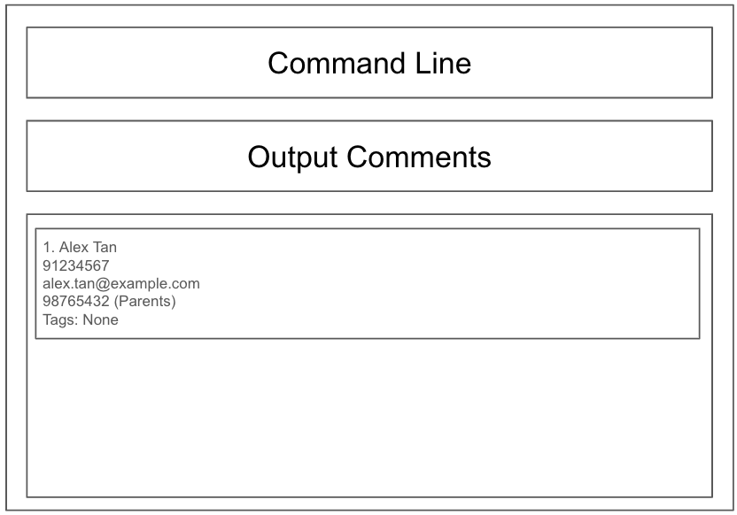

**EduEase** is a modified version of the AddressBook Level 3 (AB3) project, tailored specifically for private tutors with young tutees. 

* If you are interested in using EduEase, head over to the [_Quick Start_ section of the **User Guide**](UserGuide.html#quick-start).
* If you are interested about developing EduEase, the [**Developer Guide**](DeveloperGuide.html) is a good place to start.

**Acknowledgements**

* Libraries used: [JavaFX](https://openjfx.io/), [Jackson](https://github.com/FasterXML/jackson), [JUnit5](https://github.com/junit-team/junit5)
* This project is based on the AddressBook-Level3 project created by the [SE-EDU initiative](https://se-education.org).
